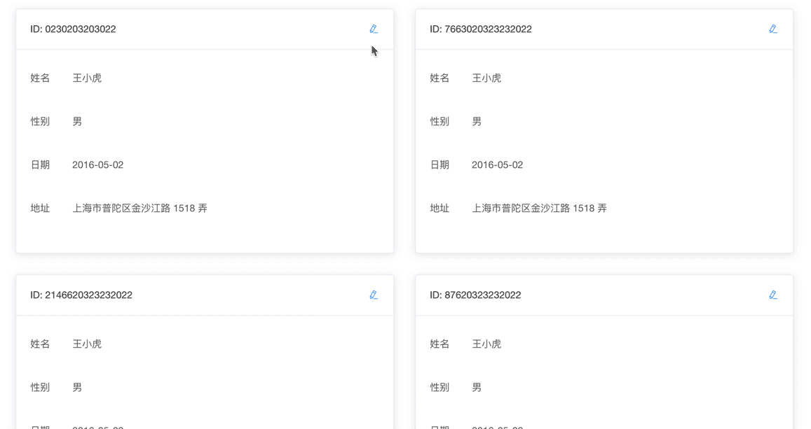

# rw-dispatcher-es

vue 表单组件读写分发器， element-ui 和 iview 的表单组件扩展，一套代码实现表单的编辑和详情（预览）功能。

文档地址: [http://xiepeng.cc/rw-dispatcher/#/](http://xiepeng.cc/rw-dispatcher/#/)

## 它能做什么

它可以一套代码实现表单的编辑和详情（预览）功能


也可以在表格中双击单元格直接编辑


还可以在卡片中直接切换到编辑状态



## git submodule init
```
git submodule init
git submodule update
```

## 安装
```
cd packages/element-ui-rw-dispatcher
yarn install

cd ../iview-rw-dispatcher
yarn install

cd ../rw-dispatcher-helper
yarn install

cd ../../
yarn install
```

### 开发
```
yarn run serve
```

### 构建
```
yarn run build
```

### 单元测试
```
yarn run test:unit
```
